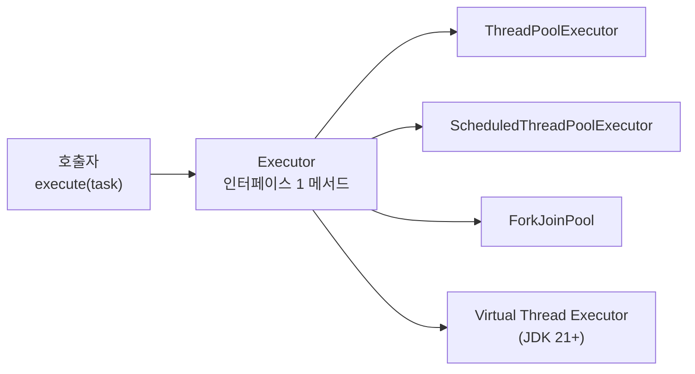

> Tomcat 딥다이브를 진행하다가 발견했다. **"`ThreadPoolExecutor`의 동작을 말할 때마다 `Thread.State`, `Runnable`, `Callable`, `Future`, `Executor`, `submit vs execute` 같은 기반 개념이 흐릿하게 섞여 있다."** 이 글은 그 기반을 단단하게 다진 학습 기록이다. 카페 비유로 mental model을 박은 다음 OpenJDK 25 소스로 검증했다.

## 진입 — 왜 또 스레드인가?

자바 동시성을 안다고 생각했다. `new Thread(() -> ...).start()`를 쓰고, `ExecutorService.submit()`을 호출한다. 그런데 막상 누가 `shutdownNow()`와 `shutdown()`의 차이를 물어보면 정확히 답하기 애매했다. `Future.cancel(true)`로 작업이 즉시 멈추는지도 헷갈렸다. `scheduleAtFixedRate`에서 task가 period보다 오래 걸리면 어떻게 되는지도 자신이 없었다.

이 글은 그 흐릿함을 7개 Stop에 걸쳐 박살낸 기록이다. 학습 메소드는 **Feynman 기법** — 비유로 mental model을 먼저 박고, 자기 말로 articulation 통과한 후에야 OpenJDK 소스를 본다.

---

## 카페 비유 — 시리즈 마스터 맵

이 시리즈는 처음부터 끝까지 **카페**라는 단일 비유 도메인을 유지한다. 새 개념이 등장해도 카페 안에서 자리잡았다.

| 카페 요소 | Java 매핑 |
|----------|----------|
| 📋 주문 게시판 | `BlockingQueue` / `DelayedWorkQueue` |
| 📋 게시판 맨 앞 주문서 | `queue[0]` (heap head) |
| 📝 주문서 | `Runnable` / `Callable` / `FutureTask` |
| 📝 주문서 첨부 박스 | lambda capture (외부 변수) |
| 👨‍🍳 바리스타 | worker `Thread` |
| ☕ 에스프레소 머신 | CPU core |
| ⏰ 예약 시간 | scheduled delay |
| 👔 정직원 vs 알바 | `non-daemon` vs `daemon` |
| 🧑‍💼 HR 채용 담당자 | `ThreadFactory` |
| 🪪 명찰 이름 | `Thread.name` |
| 📞 매니저 / 사고 보고 | `UncaughtExceptionHandler` |
| 🔒 매장 마감 | JVM shutdown |
| ⏱️ 시계 보는 1명 | leader thread (Leader-Follower) |
| 🚫 "취소" 도장 | `FutureTask.cancel()` flag |

> 🌐 풀 시각화 (12 SVG): [Java Executor Framework deck](https://logantect.github.io/decks/java-executor-framework/)

---

## 7 Stops 요약

### Stop #1 — Thread vs Runnable

가장 근본적인 질문 — 왜 `new Thread(runnable)`이지 `new MyThread()`가 아닌가?

답의 루트는 **자바 언어 제약**(단일 상속). Thread를 상속하면 다른 도메인 클래스 상속이 불가능해진다. 그래서 자바 동시성 framework 전체가 `Runnable` 인터페이스 구현 패턴 위에 서 있다.

```java
// 안 좋음 — Thread 상속
public class MyTask extends Thread {
    public void run() { /* ... */ }
}
// 이미 BusinessEntity 상속 필요? → 불가
// 실행 전략 = 무조건 새 Thread, 풀로 교체 불가

// 좋음 — Runnable 구현
public class MyTask implements Runnable {
    public void run() { /* ... */ }
}
// 다른 클래스 상속 자유
// Lambda 호환 (functional interface)
// Executor framework 통과 가능
executor.execute(new MyTask());
```

> 🌱 **씨앗**: Runnable은 작업, Thread는 실행자 — 둘을 분리하면 어떤 실행 전략도 끼워넣을 수 있다.

### Stop #2 — Thread.State 6가지

JVM이 정의하는 6개 상태. 가장 헷갈리는 부분 둘:

**1) RUNNABLE은 "CPU 위에서 실행 중"이 아니다.**

```
RUNNABLE = OS의 RUNNING + READY를 합산
         + native I/O 대기도 포함
```

JVM은 OS 스케줄러 내부를 못 본다. ready queue에서 대기 중이어도, native socket read에서 막혀 있어도 jstack에는 모두 `RUNNABLE`로 표시된다. **그래서 jstack의 RUNNABLE 다발 ≠ CPU 사용량 다발**.

**2) BLOCKED와 WAITING은 완전히 다른 락 메커니즘에서 온다.**

| 상태 | 락 종류 | 대표 호출 |
|------|--------|----------|
| `BLOCKED` | JVM monitor | `synchronized` 블록 입구 |
| `WAITING` | park 기반 (AQS, LockSupport) | `LockSupport.park`, `Object.wait`, `Thread.join`, `ReentrantLock.lock` |
| `TIMED_WAITING` | WAITING + timeout | `parkNanos`, `sleep`, `wait(timeout)` |

`ReentrantLock`도 WAITING으로 보인다. AQS 기반 park라서. `synchronized` 입구에서만 BLOCKED.

> 🌱 **씨앗**: BLOCKED는 synchronized 모니터 대기, WAITING은 park/wait/join 능동 대기 — ReentrantLock도 WAITING (AQS park 기반)

### Stop #3 — Executor 인터페이스의 위엄

자바 동시성 framework 전체가 서 있는 **한 줄의 추상화**.

```java
public interface Executor {
    void execute(Runnable command);
}
```

**메서드 1개**. 호출자는 "이 작업 받아서 어디서든 실행해"만 안다. 언제, 어디서, 어떻게 실행되는지 모른다.



호출 코드는 그대로 두고, 구현체만 바꿀 수 있다. 가상 스레드(Project Loom)로 마이그레이션할 때도 호출 코드 0줄 변경. **SRP의 극단 사례.**

> 🌱 **씨앗**: Executor는 '작업을 던진다'와 '실행 전략'을 분리하는 가장 작은 추상화 (메서드 1개, `void execute(Runnable)`)

### Stop #4 — ExecutorService와 shutdown의 함정

Executor 위에 **lifecycle + Future + bulk + AutoCloseable** 4가지를 얹은 인터페이스. 실무에서 만나는 거의 모든 풀의 부모.

**가장 위험한 함정 = `shutdownNow()`는 kill -9가 아니다.**

```java
pool.shutdownNow();
// → worker thread에 Thread.interrupt() 호출만 함
// → 작업 코드가 InterruptedException 처리 안 하면 무시됨
// → "shutdownNow 했는데 안 멈춰요" = 작업 코드의 interrupt 비협조가 원인
```

JCIP Ch.7의 graceful shutdown 패턴이 표준:

```java
void stop(ExecutorService pool) {
    pool.shutdown();                                  // 1. 새 task 거부
    try {
        if (!pool.awaitTermination(30, SECONDS)) {    // 2. graceful 30초 대기
            pool.shutdownNow();                       // 3. 안 되면 interrupt
            if (!pool.awaitTermination(10, SECONDS)) {
                System.err.println("풀이 안 종료됨");
            }
        }
    } catch (InterruptedException e) {
        pool.shutdownNow();
        Thread.currentThread().interrupt();
    }
}
```

JDK 19+부터 `ExecutorService`가 `AutoCloseable` 구현이라 try-with-resources로 더 깔끔하다:

```java
try (ExecutorService pool = Executors.newFixedThreadPool(4)) {
    pool.submit(() -> doWork());
}  // 블록 끝 = 자동 graceful shutdown
```

> 🌱 **씨앗**: shutdownNow는 'interrupt 신호'이지 '강제 종료'가 아님 — 작업이 InterruptedException 처리해야 멈춤

### Stop #5 — Future의 park/unpark 두 액터 모델

`future.get()`을 호출한 스레드는 **자기 자신을 park** (즉 WAITING 상태로 전환). worker가 task 끝나면 그 caller를 **unpark**.

```
caller:  submit ─► get() 호출 ─[park]──────► 결과 반환
                              ↓               ↑
                              자기를 재움     worker가 unpark

worker:  큐 pull ─► task.run() ─► setResult ─► unpark(caller)
```

- **park = self** — 호출 스레드가 자기 자신을 잠재움 (`LockSupport.park()`)
- **unpark = other** — 외부 스레드가 잠든 스레드 깨움 (`LockSupport.unpark(thread)`)

이게 AQS 전체가 작동하는 방식. `ReentrantLock`, `Semaphore`, `CountDownLatch` 모두 같은 park/unpark 패턴.

**가장 헷갈렸던 부분 — `cancel(true)`의 진실**:

```java
future.cancel(true);  // ← true가 뭘 의미하는가?
```

`true`는 "**worker thread에 `Thread.interrupt()` 호출 허용**". 강제 종료가 아니다. worker 코드가 `InterruptedException` 처리하거나 `Thread.interrupted()` 체크하지 않으면 — **worker는 계속 실행**된다. `Thread.stop()`은 deprecated. 자바에선 **모든 취소가 협조적**.

```java
Future<?> f = pool.submit(() -> {
    while (true) {              // ← interrupt 체크 없음
        heavyComputation();
    }
});

f.cancel(true);
// f.isCancelled() == true
// f.isDone() == true
// but worker thread는 무한 루프 계속 ⚠ thread leak
```

> 🌱 **씨앗**: isDone()은 'Future 객체가 결과를 더 안 받는다'는 뜻이지, '실제 worker가 멈췄다'는 뜻이 아니다

### Stop #6 — ScheduledExecutorService의 3가지 함정

가장 함정이 많은 인터페이스. 세 가지 답이 모두 **직관과 다르다**.

**함정 1 — `scheduleAtFixedRate(period=1초)`에서 task가 3초 걸리면?**

직관: 1초마다 새 스레드에서 병렬 실행될 거 같다 → **틀림**.
실제: 같은 task의 병렬 실행은 **구조적으로 불가능**. period 놓치면 즉시 따라잡기.

```java
// ScheduledFutureTask.run() (OpenJDK 25, line 305-314)
public void run() {
    if (!canRunInCurrentRunState(this))
        cancel(false);
    else if (!isPeriodic())
        super.run();
    else if (super.runAndReset()) {        // (1) 동기 호출, task 끝날 때까지 BLOCK
        setNextRunTime();                  // (2) 끝난 후 다음 시간 계산
        reExecutePeriodic(outerTask);      // (3) 큐에 재등록
    }
}
```

`runAndReset()`이 **동기 호출**이라 task 실행 중엔 큐에 다음 인스턴스 자체가 없다. 따라서:

- **fixedRate** (이전 시작 + period): period 놓치면 끝나는 즉시 따라잡기 → **3초 간격 burst**
- **fixedDelay** (이전 종료 + delay): task 종료 후 항상 1초 gap → 자연 backoff

**실무 디폴트 = fixedDelay**. fixedRate는 burst로 DB 부하 spike 위험.

갈림길은 `period` 필드 부호 하나:

```java
// setNextRunTime() (line 284-290)
private void setNextRunTime() {
    long p = period;
    if (p > 0)
        time += p;              // fixedRate: 이전 time + period
    else
        time = triggerTime(-p); // fixedDelay: NOW 기준 재계산
}
```

**함정 2 — Leader-Follower 패턴이 헷갈리는 이유**

worker 2명에 예약 주문 1건이 있다면? 둘 다 시계를 봐야 할까? 둘 다 보면 1명이 낭비된다. 그래서 JDK는 **1명만 시계 보고 나머지는 잠**.

```
바리스타 2명. 큐에 "5분 뒤 픽업 예약" 1건.
  ┌─ 바리스타-1: "내가 시계 봄" (leader) → awaitNanos(5분)
  └─ 바리스타-2: 잠 (follower) → available.await() 무한 대기

5분 후 leader가 깨어남 → 처리 + 옆 바리스타에게 signal
```

이게 Leader-Follower 패턴. **단, delay ≤ 0 (지금 due)일 땐 우회한다**. 큐 head가 이미 시간 지났으면 leader 설정 없이 즉시 받음 + signal chain으로 다음 worker도 깨움. 그래서 **두 task가 동시 due면 worker 수만큼 병렬 실행**.

```java
// DelayedWorkQueue.take() (line 1147-1179)
long delay = first.getDelay(NANOSECONDS);
if (delay <= 0L)
    return finishPoll(first);   // (★) leader 설정 X, 즉시 반환
// ...
if (leader != null)
    available.await();          // 이미 leader 있음 = 잠
else {
    leader = thisThread;        // 내가 leader
    available.awaitNanos(delay);// 시계 봄
}
```

이 부분을 자기 말로 풀어보라고 했을 때 — *"예약 주문이 있을 때 1명만 시계를 보면 되니까 나머지는 자거나 다른 일을 할 수 있다"* — 이게 Feynman articulation이 도달한 결론이다.

**함정 3 — `cancel()`은 큐에서 안 떼버린다 (메모리 leak)**

```java
ScheduledFuture<?> f = scheduler.schedule(() -> doWork(), 1, HOURS);
f.cancel(false);
```

cancel은 task에 "취소" flag만 찍는다. **큐에 그대로 둔다**. 시간 되면 `take()`로 꺼내져 무시되며 정리.

```java
// ScheduledThreadPoolExecutor.java:175-177
volatile boolean removeOnCancel;     // ⚠ default = false
```

왜 default가 이런가? heap 임의 위치 제거는 O(log N), 도장만 찍기는 O(1). CPU 절약 디자인.

**하지만 lambda capture가 큰 경우 = 메모리 leak**:

```
[DelayedWorkQueue] → 참조 → [ScheduledFutureTask] → 참조 → [lambda 외부 변수 1MB]
```

task가 큐에 살아있으면 → task가 들고 있는 lambda capture **GC 못 됨**. 다음 스케줄 시간까지 메모리 leak.

```
매일 1만 예약 등록, 평균 1MB lambda capture, 50% 취소
→ default(false): 5천 cancelled task × 1MB = 5GB 메모리 1시간 leak
→ 1주일 미래 task면 35GB → JVM heap 8GB면 확실 OOM
```

해결:
```java
ScheduledThreadPoolExecutor scheduler = new ScheduledThreadPoolExecutor(2);
scheduler.setRemoveOnCancelPolicy(true);
```

cancel이 자주 일어나거나 미래 task가 멀거나 큰 lambda capture 있으면 **반드시 true 설정**.

> 🌱 **씨앗**: ScheduledFuture.cancel() default = 큐에서 안 떼고 도장만 찍음 — task가 들고 있는 외부 변수가 다음 스케줄까지 메모리 점유 = leak. setRemoveOnCancelPolicy(true) 필수

### Stop #7 — ThreadFactory와 가장 무서운 함정 (silent failure)

`ThreadFactory`는 카페의 **HR 채용 담당자**. worker thread를 만들 때 4가지 정책을 결정한다.

| HR 결정 | Java 매핑 |
|---------|----------|
| 🪪 명찰 이름 | `Thread.name` |
| 👔 정직원 vs 알바 | `non-daemon` vs `daemon` |
| 📞 사고 보고 라인 | `UncaughtExceptionHandler` |
| ⚡ 우선순위 | `Thread.priority` |

`Executors.newFixedThreadPool(n)`의 default factory는:

```java
// Executors.DefaultThreadFactory:609-632
public Thread newThread(Runnable r) {
    Thread t = new Thread(group, r, namePrefix + threadNumber.getAndIncrement(), 0);
    if (t.isDaemon())
        t.setDaemon(false);                  // non-daemon 강제
    if (t.getPriority() != Thread.NORM_PRIORITY)
        t.setPriority(Thread.NORM_PRIORITY); // NORM_PRIORITY 강제
    return t;
}
```

- 이름: `pool-1-thread-1`, `pool-1-thread-2`, ...
- 데몬: **false 강제**
- 우선순위: NORM 강제

**Production 표준 = custom ThreadFactory**. 이유 두 가지:

1. **default 이름은 운영 디버깅 지옥** — jstack에서 `pool-3-thread-7`이 어느 비즈니스 thread인지 모름
2. **`UncaughtExceptionHandler` 설치 필수** — default는 stderr만 출력

```java
ThreadFactory factory = r -> {
    Thread t = new Thread(r, "order-processor-" + counter.getAndIncrement());
    t.setDaemon(false);
    t.setUncaughtExceptionHandler((thread, ex) ->
        log.error("uncaught in {}", thread.getName(), ex)
    );
    return t;
};
```

**가장 무서운 함정 — execute vs submit 경로 차이**:

```java
// 케이스 A
pool.execute(() -> { throw new RuntimeException("A"); });

// 케이스 B
Future<?> f = pool.submit(() -> { throw new RuntimeException("B"); });
```

어느 케이스에서 `UncaughtExceptionHandler`가 호출될까? 직관적으로 "둘 다 안 호출. main이 worker 예외 못 잡으니까"라고 답하기 쉽다 → **틀림**.

`UncaughtExceptionHandler`는 ThreadFactory에서 **worker thread 본인에게 설치**되어 있다. main과 무관. 비유로: **바리스타(worker)가 손 데임 → 본인이 직접 매니저(handler)에게 보고**. 사장(main)이 catch하는 게 아니다.

**execute path**: `task.run()` 예외 → `runWorker`가 catch → re-throw → worker uncaught path → **handler 호출** ✓

```java
// ThreadPoolExecutor.runWorker:1087-1095
try {
    task.run();
    afterExecute(task, null);
} catch (Throwable ex) {
    afterExecute(task, ex);
    throw ex;            // ← re-throw → worker uncaught path
}
```

**submit path**: `FutureTask.run()`이 try-catch로 예외 흡수 → `setException()` → **Future.outcome 저장** → worker는 정상 종료 → handler **호출 X**

```java
// FutureTask.run:318-337
try {
    result = c.call();
    ran = true;
} catch (Throwable ex) {
    setException(ex);    // ← 예외 흡수 → Future.outcome 저장
}
```

→ **`submit` 사용 후 `Future` 무시 = 예외가 영원히 사라짐 = production 최악 안티패턴**.

```java
// 안티패턴
pool.submit(() -> saveToDB(order));
// → Future 안 받음 → setException 호출되었지만 어디서도 get() 안 함
// → 예외 영원히 사라짐
// → 로그 무, 알람 무, 매트릭 무
// → DB write 실패했는데 아무도 모름
// → 수일~수주 후 데이터 손실 발견. 추적 거의 불가
```

**해결 3가지 패턴**:

```java
// 1. Future.get() 의무
Future<?> f = pool.submit(() -> saveToDB(order));
try { f.get(); }
catch (ExecutionException e) { log.error("DB failed", e.getCause()); }

// 2. task 내부 try-catch
pool.submit(() -> {
    try { saveToDB(order); }
    catch (Exception e) { log.error("DB failed", e); }
});

// 3. execute로 변경 (Future 회수 불필요할 때)
pool.execute(() -> saveToDB(order));
// → 예외 시 UncaughtExceptionHandler 호출
```

> 🌱 **씨앗**: execute = handler path (worker uncaught), submit = FutureTask path (Future.outcome 저장). Future 무시 = silent failure = production 최악 안티패턴

---

## Production 함정 정리

1편 진행 중 발견한 production 함정 8개. 디버깅 난이도 큰 순서:

1. **submit + Future 무시 = silent failure** — 예외가 Future.outcome에 갇혀 사라짐. 로그/알람/매트릭 0.
2. **setRemoveOnCancelPolicy(true) 누락 = 메모리 leak** — cancelled task가 큐에 남아 lambda capture까지 GC 못 됨.
3. **scheduled task 예외 = 영구 중단** — `setNextRunTime()` 도달 못함 → 다음 스케줄 안 박힘. 로그도 안 남음.
4. **fixedRate burst 폭주** — task가 period보다 길어지면 즉시 따라잡기 → DB 부하 spike.
5. **shutdownNow ≠ kill -9** — worker에 interrupt 호출만. 작업이 협조 안 하면 무시.
6. **shutdown 누락 → JVM hang** — worker가 non-daemon이라 main 끝나도 JVM 안 죽음.
7. **cascading delay (worker 부족)** — scheduled task N개에 corePoolSize < N이면 1초 주기가 1.5초로 밀림.
8. **cancel(true) → thread leak** — worker가 interrupt 협조 안 하면 isCancelled=true지만 thread 계속 실행.

---

## 학습 메소드 — Feynman + 카페 비유 + OpenJDK

이 시리즈는 **Feynman 기법**으로 진행했다. Claude에게 진단적 시험관 역할을 시킨 형태. 핵심 규칙:

1. **비유 먼저** — code/jargon dump 금지. 카페 도메인 일관 유지.
2. **직관 질문** — 4지선다 또는 open question. 한 번에 한 질문.
3. **사용자 답변 + 이유 1줄** — 이유 없으면 진행 X.
4. **jargon probe + narrow** — 풀어쓰기 의무. 반복 misconception → STOP + 비유 재설정.
5. **빈칸 articulation** — 3~6칸. 인과 구조 강제.
6. **mirror 검증** — 사용자 표현 그대로. 교과서 추가 금지.
7. **source reveal** — articulation 통과 후에만 OpenJDK 인용 (버전/path/line).
8. **trap question** — production 함정 노출.

이번 시리즈에서 가장 잘 작동한 articulation 3건:

| 질문 | 사용자 articulation |
|------|------------------|
| Leader-Follower (Q-6.2) | "예약 주문이 있을 때 1명만 시계를 보면 되니까 나머지는 자거나 다른 일을 할 수 있다" |
| 메모리 leak (Q-6.3) | "취소된 작업이 큐에 남아있으면 그 작업이 들고 있는 외부 데이터도 함께 살아있어서 다음 스케줄까지 메모리가 점유된다" |
| Silent failure (Q-7.2) | "execute() 예외는 worker thread의 uncaught path로 전파되어 handler 호출. submit() 예외는 FutureTask가 잡아서 Future에 저장하므로 get()을 호출해야 회수 가능. 호출 안 하면 silent failure 발생" |

이 학습 메소드 자체를 `wiki-feynman`이라는 Claude Code skill로 정리했다. 다른 시리즈에 재사용 가능.

---

## 다음 편 예고

**2편 — JDK ThreadPoolExecutor 내부 분해**

- `corePoolSize` / `maximumPoolSize` / `workQueue`의 상호작용 (3가지 분기점)
- 4가지 RejectedExecutionHandler 정책
- Worker thread lifecycle (생성/idle/keep-alive/종료)
- `Tomcat TaskQueue.offer()`의 거짓말 — execute() race defense

같은 카페 비유로 풀어낼 예정.

---

## 참고

- 🌐 **시각화 deck** (12 SVG): [java-executor-framework](https://logantect.github.io/decks/java-executor-framework/)
- 📚 **OpenJDK 25** (jdk-25-ga): [github.com/openjdk/jdk](https://github.com/openjdk/jdk/tree/jdk-25-ga)
- 📖 **JCIP** (Java Concurrency in Practice, Brian Goetz) — Ch.6, Ch.7
- 🔧 **학습 메소드 skill**: `wiki-feynman` ([github.com/logantect](https://github.com/logantect))

---

> 이 글은 Obsidian wiki vault의 [deepdive 학습 기록](https://github.com/logantect)을 블로그 형식으로 정리한 것이다. 동일 내용을 **3 layer로 운영**: ① 시각화 deck (외부 공유용 HTML), ② wiki concept 페이지 (vault 내부 검색용), ③ blog post (이 글 — narrative).
