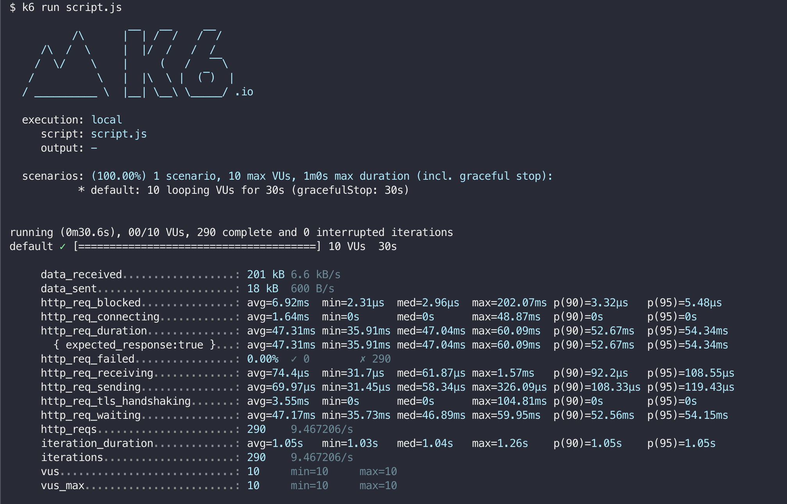
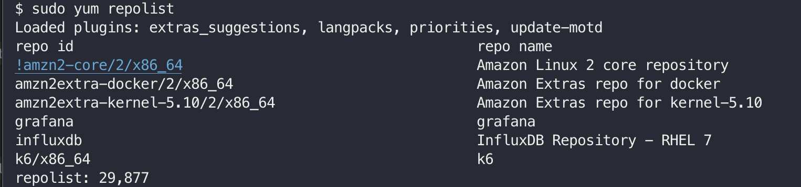
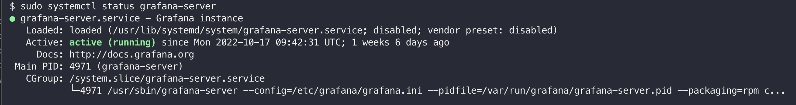
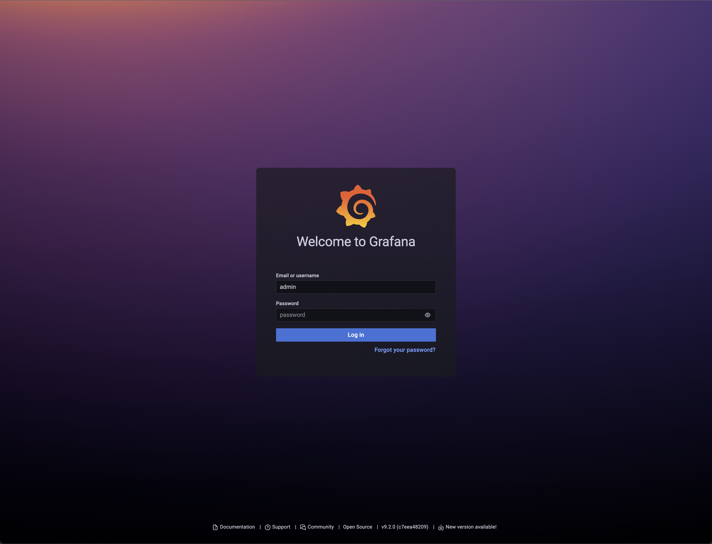
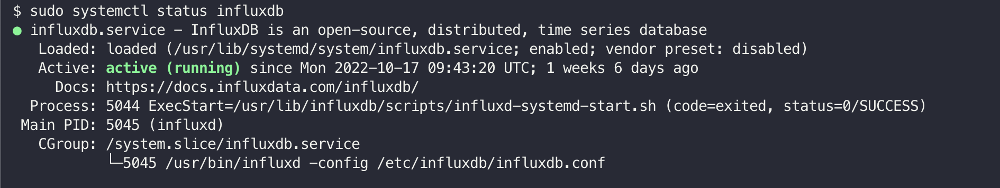
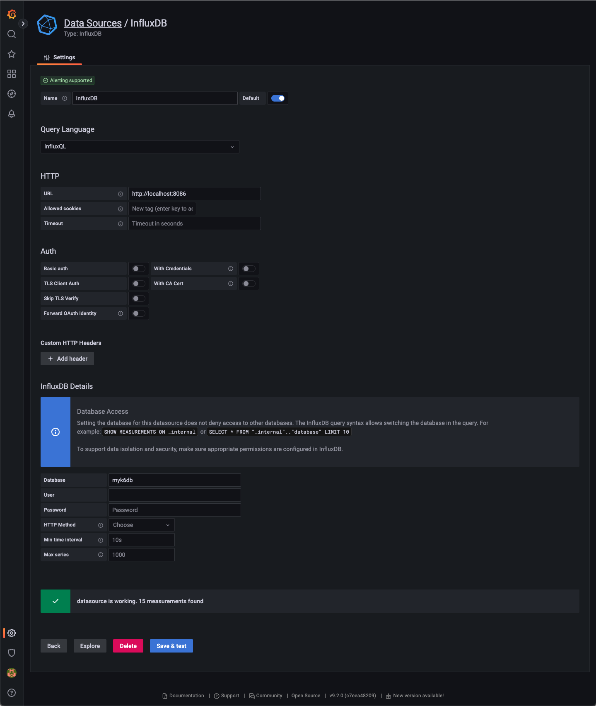
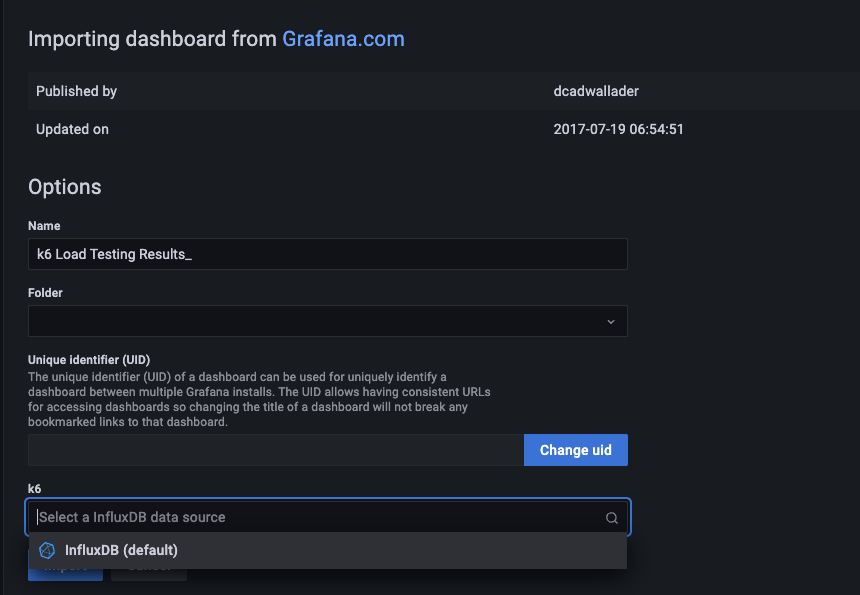

> 부하테스트 도구 중 하나인 k6로 부하테스트 시작해보자 

## k6 설치

`Amazon Linux 2`는 k6에서 사용하는 PGP V4 서명을 지원하지 않기 때문에 설치시 비활성화 옵션을 추가하여 설치
```shell
$ sudo yum install https://dl.k6.io/rpm/repo.rpm
$ sudo yum install --nogpgcheck k6 -y
```

## k6 실행
k6는 JavaScript ES6 모듈로 작성할 수 있다.  
다음 코드를 복사하여 script.js로 저장하자.

```js
import http from 'k6/http';
import { sleep } from 'k6';
export const options = {
  vus: 10,
  duration: '30s',
};
export default function () {
  http.get('http://test.k6.io');
  sleep(1);
}
```

다음 명령으로 k6를 실행할 수 있다.
```shell
$ k6 run script.js
```

## 실행결과
  

총 290번 요청 되었다 `sleep(1)`이 주어졌기 때문이다. 즉, 초당 10명의 가상유저가 30초 동안 요청을 한 것으로 알 수 있다.

이번엔 Grafana와 InfluxDB를 사용하여 모니터링을 해보자.

## Grafana 설치 및 실행

### Grafana YUM 저장소 추가
```shell
$ sudo yum update -y
$ sudo vim /etc/yum.repos.d/grafana.repo
```
아래 내용 추가
```text
[grafana]
name=grafana
baseurl=https://packages.grafana.com/oss/rpm
repo_gpgcheck=1
enabled=1
gpgcheck=1
gpgkey=https://packages.grafana.com/gpg.key
sslverify=1
sslcacert=/etc/pki/tls/certs/ca-bundle.crt
```

### YUM 리포지토리 확인
```shell
sudo yum repolist
```



### Grafana 설치
```shell
$ sudo yum install grafana
```

### Grafana 실행
```shell
$ sudo systemctl start grafana-server
```

### Grafana 상태 확인
```shell
$ sudo systemctl status grafana-server
```


### Grafana 접속
Grafana는 3000번 포트를 사용합니다.
초기 비밀번호 : admin / admin



## InfluxDB 설치 및 실행

### YUM 저장소 추가
```shell
$ cat <<EOF | sudo tee /etc/yum.repos.d/influxdb.repo
```
아래 내용 추가
```text
[influxdb]
name = InfluxDB Repository - RHEL 7
baseurl = https://repos.influxdata.com/rhel/7/x86_64/stable
enabled = 1
gpgcheck = 1
gpgkey = https://repos.influxdata.com/influxdb.key
EOF
```

### YUM 리포지토리 확인
```shell
sudo yum repolist
```


### InfluxDB 설치
```shell
$ sudo yum install influxdb -y
```

### InfluxDB 실행
```shell
$ sudo systemctl start influxdb
```

### InfluxDB 상태 확인
```shell
$ sudo systemctl status influxdb
```


## InfluxDB를 지정하여 k6 스크립트 실행 
```shell
$ k6 run --out influxdb=http://localhost:8086/myk6db script.js
```


## Grafana 설정

### Data Source 추가
`Configuration` > `Data sources` 메뉴에서 `Add data source` 클릭하여 추가합니다.  
아래 쪽에 `Database` 항목에 위에서 실행했던 `myk6db`입력 후 `Save & test` 클릭. 


### 대시보드 설정
`Dashboards` > `Import` > 'Import via Grafana.com' 항목에 2587을 입력


'Select a InfluxDB Data source' 항목에 위에서 만들어 둔 InfluxDB 데이터 소스 추가



이렇게 k6를 활용하여 부하테스트 진행 및 모니터링을 진행하는 방법을 알아보았다.  
다음 포스팅에는 k6에서 제공하는 스크립트를 활용한 여러가지 부하테스트를 알아보도록 하자. 

## 참고
* https://k6.io/docs/getting-started/installation
* https://k6.io/docs/getting-started/running-k6
* https://k6.io/docs/getting-started/results-output
* https://www.radishlogic.com/aws/ec2/how-to-install-grafana-on-ec2-amazon-linux-2
* https://techviewleo.com/how-to-install-influxdb-on-amazon-linux